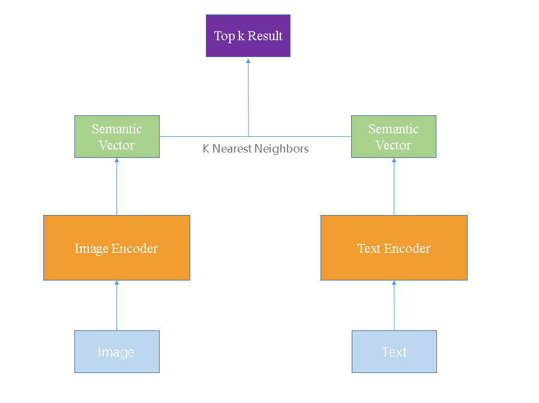
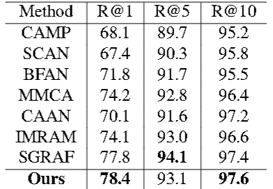
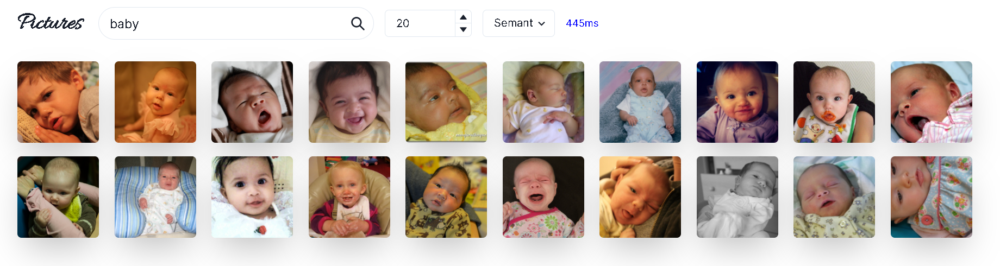
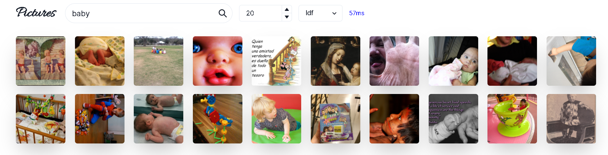
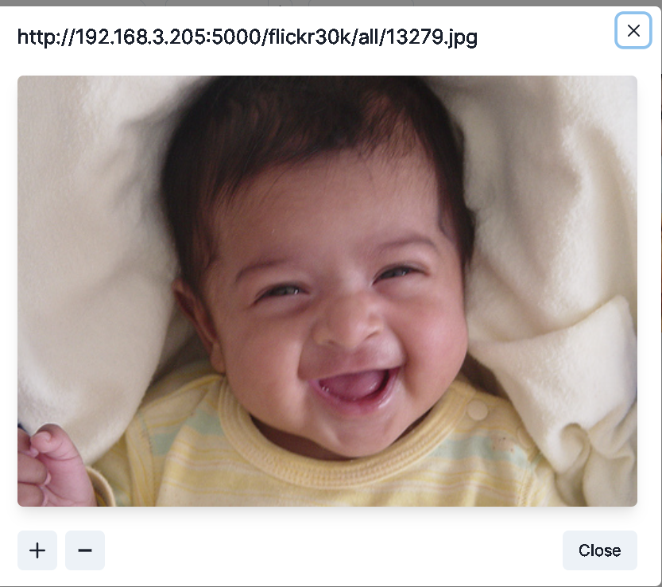
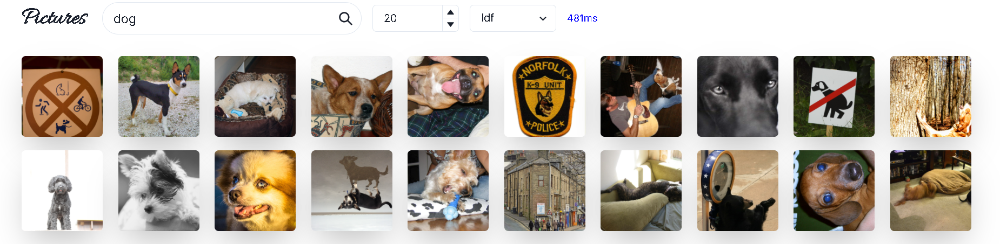
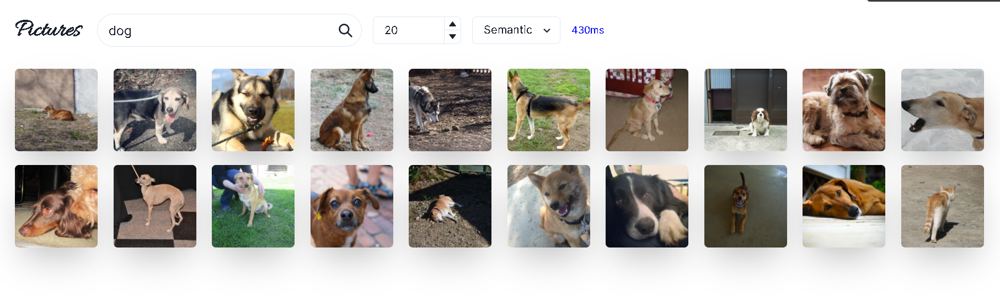
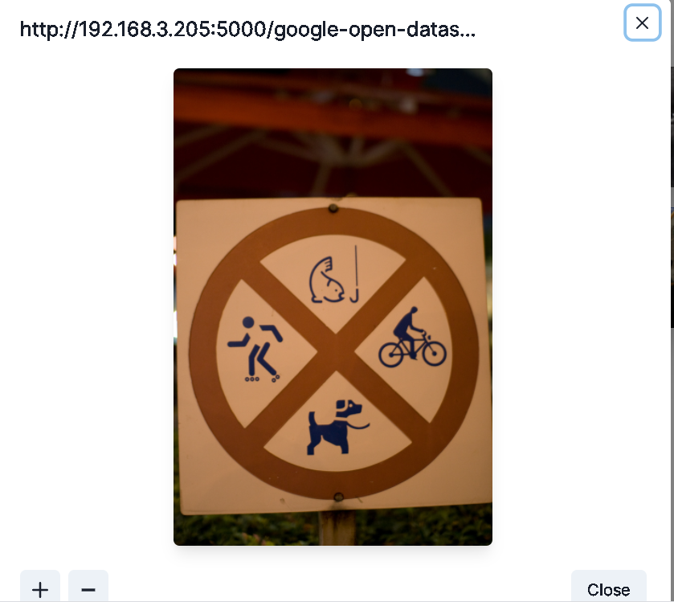

#### 问题描述

​	本组选题为图片搜索引擎，其旨在通过查询词文本与图片进行匹配，返回相关图片并进行排序，并支持在前端进行浏览等操作。

​	目前的图片检索任务往往具有两种方式，一种是通过图片数据中已有的文本标签信息，构建tf-idf模型，结合倒排索引，进行图片检索。另一种是通过机器学习的方式，学习图片和检索词的语义表示，在语义空间上进行图片和文本的语义匹配，从而得到更加灵活和精准的搜索结果。在我们的实现中，我们同时实现了这两种图片搜索技术，并对它们的表现进行了对比和分析。

#### 实现模块

​	当前图片搜索引擎主要可以分为两大模块：前端交互和后端搜索，其中后端搜索中包括TF-IDF和深度模型两个子模块。我们将分别对这几个模块的原理和实现功能进行分析。

##### 前端交互界面

​	使用`react`进行开发，用户可输入搜索关键词，选择模型类型，选择返回结果数目，进行搜索并查看返回结果图片，对结果图片可以选中并放大、缩小、显示原图等；在搜索过程中，也会显示当前查询耗时；当用户用同一关键词进行查询时，前端会对搜索结果进行缓存，以减小服务端请求压力，同时当用户重新焦点在交互界面时，亦会对查询结果进行更新。

##### 后端搜索引擎

​	后端使用`python`进行开发，分别进行 tf-idf 和深度模型的训练，在训练结束后，即可根据指定的模型类型，使用不同的模型进行关键词的查询，返回排序后的相关图片结果，服务端使用 flask 提供关键词图片搜索接口与静态服务图片接口，同时使用了跨域插件，接口格式采用 REST 风格，便于其他前端接入。

**TF-IDF + 倒排索引**

​	在TF-IDF模块中，我们使用了Google-Open-Dataset[^1]子集7作为图片数据集，它是Google-Open-Dataset的一个子集，其中共包括来自19994类的106047张图片（部分类别在数据集中可能没有出现)。

​	在算法实现上，对于给定的图片集${X=\{X_1,X_2,...,X_N\}}$,我们定义其文本标签集为$Y=\{Y_1,Y_2,...,Y_N\}$,其中$Y_i = \{w_1,w_2,...,w_k\}$为第$i$张图片分词后得到的所有的文本标签。我们使用了基本的英文分词器，即根据可能的间隔符进行划分。

​	我们可以得到词库$W = \bigcup_{i=1}^{N} Y_i$，则对于任意词语$w_i$，我们可以得到其对第$j$个图片的TF值为:
$$
TF_{i,j} = \frac{t_{i,j}}{\sum_k t_{k,j}}
$$
​	其中$t_{i,j}$为第$i$个关键词在第$j$个图片的标签中出现的频数。

​	同样，我们还可以得到第$i$个词语的IDF值为:
$$
IDF_i = \log{\frac{|W|}{1 + |\{j|w_i\in Y_j\}|}}
$$
​	因此我们可以得到$w_i$在第$j$个图片中的$TF-IDF$值为:
$$
TF\_IDF_{i,j} = TF_{i,j} \times IDF_i
$$
​	因此，我们可以构建关键词关于图片的倒排索引，对于每一个关键词，其中的图片根据其$TF-IDF$值进行排序。在查询时，对于指定的关键词，我们只需返回其图片列表的前$K$张图片即可。若查询关键词不止一个，则对其图片列表进行归并排序并取交集，再返回前$K$张图片。

**深度语义匹配**

​	虽然TF-IDF模型由于其易用性，可以在很多检索任务上取得较好的结果。但对于图片搜索任务，其依然具有一定的缺点。对于常见的图片数据集，其文本标签的数量往往远远小于互联网中文档的大小，导致基于频率的TF-IDF模型的表现较差。其次，对于图片数据集，基于其标签构建的TF-IDF模型往往无法泛化到其它的图片数据，尤其是数据集中未出现和出现很少的文本标签上。同时基于标签构建的TF-IDF模型往往无法进行连续文本(例如一段对图片的段落或句子描述)的搜索，这限制其使用的场景。

​	考虑到以上问题，我们在TF-IDF模型的基础上，构建了深度语义匹配模型，其使用经典的双塔结构，通过text-encoder和image-encoder将文本和图片映射到同一个语义空间，再通过K近邻进行文本和图片的匹配，训练模型针对文本和图片学习更好的语义表示。模型的示意图如下:

​	

​	其中，Image Encoder使用在ImageNet预训练后得到的ResNet50[^2]模型，Text Encoder使用BERT[^3]，配置为12 layer $\times$ 768 hidden size.使用MLP Head将两个Encoder得到的特征向量映射到256维语义空间后，再基于cos距离进行K近邻匹配。

​	训练时，我们使用对比损失函数,对于一对互相匹配的文本-图像对$(v,t)$，我们将一个batch内的其它样本对视为负样本，同时使用margin loss，得到:
$$
L(v,t) = max(0,\gamma - S(v,t) + S(v,t^-)) + max(0,\gamma - S(v,t) +S(v^-,t))
$$
​	其中，$S(v,t)$是图片和文本语义向量的cos距离，$\gamma$为超参数，$t^-$为对于图片$v$，该batch内最难的负样本，$v^-$为对于文本$t$，该batch内最难的负样本。	

​	在数据集上，我们引入了Flickr30K[^4]数据集，该数据集共有31783张图片，每张图片配有5句不同的文本描述。我们按照该数据集上研究的惯例，将数据按8:1:1划分为训练集、验证集、测试集，并进行训练。在最后模型上线推理时，使用Flickr 30K中所有图像和Google Open Dataset中的所有图像进行检索。在上线时加入Google Open Dataset是为了提高搜索引擎的图片数量和类别多样性，并且实际结果显示，基于Flickr30K训练的网络在该数据集上也具有良好的泛化性能。

#### 关键功能

​	1. 前端: 基于关键词的图片搜索，不同数量图片的显示。图片的点击、缩放、显示原图。

​	2. 后端: 基于TF-IDF和倒排索引的图片搜索，基于深度语义匹配的图片搜索。

#### 测试结果

​	首先，我们将展示关键功能的实现结果

1.  Semantic Search

   ​	为检测语义匹配模型的效果，我们在Flickr30K数据集上，对文本—图像检索(Sentence Retrieval 即输入文本匹配图片)的结果，汇报Recall@1,Recall@5,Recall@10三项指标，与其他State-of-art模型进行比较，结果如下表:

   ​	

   ​		

   ​	分析结果，从模型上，我们并未使用较以往方法更加复杂的模型和训练设计，但是却出人意料的取得了接近SOTA的结果。其中最主要的原因在于，在Flickr30K dataset上，过往的文章通常要同时开展两项任务，即Sentence Retrieval和Image Retrieval，分别对应输入文本和图片的匹配结果。因此其模型设计，训练思路都意图同时兼顾这两大任务的表现。而我们的搜索引擎只需要应对Sentence Retrieval的任务，因此相当于我们只对原任务的子任务进行了专门的训练，因此取得较好的效果也是可以理解的。

   ​	以"baby"为关键词，语义匹配模型搜索结果图如下

   

2.  TF-IDF Search

   ​	  以"baby"为关键词，TF-IDF搜索结果图如下:

   

3. 图片浏览

   ​	点击图片之后，我们可以浏览图片的URL,并对图片进行缩放操作

   

#### 样例分析

​	在查询词分析上，我们对TF-IDF模型和语义匹配模型准备了三条样例进行分析，分别代表不同长度，不同难度的查询。结果如下:

**查询词1: dog**

​	TF-IDF搜索结果:

​	Semantic Search搜索结果:

​	可以看到，对于"dog"这样简单的查询，TF-IDF和Semantic Search都能返回不错的查询结果，但是美中不足的是，由于TF-IDF模型中，查询词和图片之间是根据出现频数关系匹配，而对于图片，由于其标签是由目标检测所生成，查询词在其标签中出现并不能很好的描述查询词在图片中的位置和重要性，因此可以看到，在TF-IDF模型中出现了这样的搜索结果:

​	可以看到，以上两张图片中均带有"dog"的标签，但是实际上"dog"本身对图片的重要性却很小，但是图片上其余标签的TF值也均为1，因此TF-IDF并不能解决这样的场景。

**查询词2: beautiful woman**

​	TF-IDF搜索结果:

​	空

​	Semantic Search搜索结果:

​	

​	在这一查询下，由于TF-IDF会对搜索文本中的每个查询词的倒排列表求交集，而原数据集中并没有"beautiful"和"woman"的标签组合，因此TF-IDF模型无法返回有效的搜索结果。而语义匹配下，模型却可以很好的捕捉到文本和图片的语义信息，返回正确的结果。

**查询词3:girls and boys playing on the grass**

​	TF-IDF搜索结果:

​	空

​	Semantic Search搜索结果:

​	可以看到，在应该较长的，且十分具体的查询时，TF-IDF由于其基于词的离散化标签，并不能应对这样的场景。而语义匹配方法，则可以精准的匹配到符合查询语义的图片。

​	虽然以上的结果显示，语义匹配在图片搜索上具有一定的优势。但是其泛化能力也并不是万能的，例如下图:

​	可以看到返回结果中出现了一些很诡异的图片，检查数据集我们发现，这些图片的文本描述中确实经常有”human“出现。这意味着，以数据驱动的语义匹配在现实互联网更加复杂、脏乱的数据环境下，可能需要额外的数据工程才能正常使用。

#### 开源资料

​	无参考引用的开源资料。

#### 参考代码

​	无

[^1]: Kuznetsova A, Rom H, Alldrin N, et al. The open images dataset v4[J]. International Journal of Computer Vision, 2020: 1-26.
[^2]: He K, Zhang X, Ren S, et al. Deep residual learning for image recognition[C]//Proceedings of the IEEE conference on computer vision and pattern recognition. 2016: 770-778.
[^3]:Devlin J, Chang M W, Lee K, et al. Bert: Pre-training of deep bidirectional transformers for language understanding[J]. arXiv preprint arXiv:1810.04805, 2018.
[^4]: Young P, Lai A, Hodosh M, et al. From image descriptions to visual denotations: New similarity metrics for semantic inference over event descriptions[J]. Transactions of the Association for Computational Linguistics, 2014, 2: 67-78.